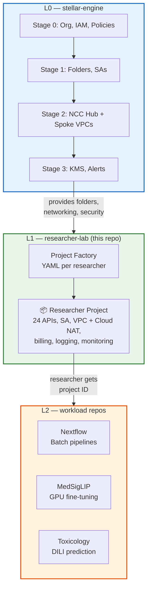
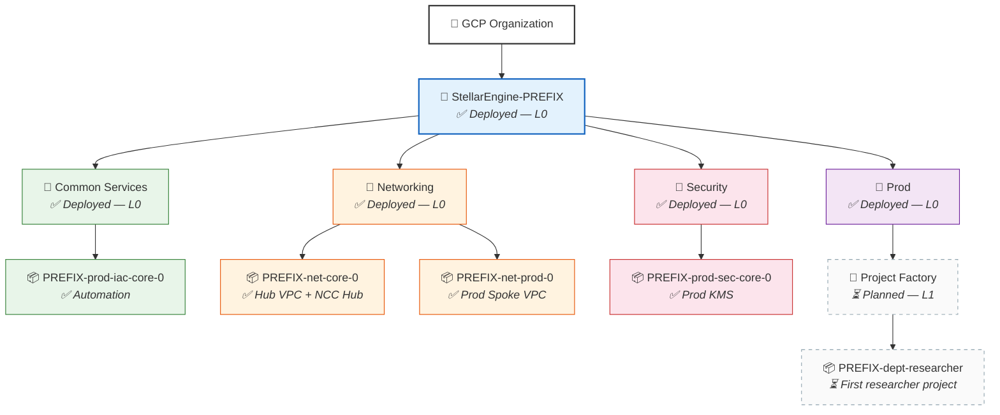

# Fast Science L1 — Researcher Labs

A fork of [Stellar Engine](https://github.com/gcp-stellar-engine/stellar-engine) that provisions researcher projects on top of an [L0 foundation](https://github.com/WandLZhang/fast-science-0-stellar-engine). This repo helps IT administration create department folders and base projects. The researcher can then deploy a workload from the L2 catalog.

## Architecture



## L1 Deployment Questionnaire

Fill in your values for researcher project provisioning. These feed into the project factory YAML and `terraform.tfvars`.

| # | Question | Your Value | Where It Goes |
|---|----------|-----------|---------------|
| 1 | **L0 Prefix** (same prefix used in L0 Stage 0) | `________` | Used to find outputs bucket: `<prefix>-prod-iac-core-outputs-0` |
| 2 | **Domain** (same as L0) | `________` | `envs_folders.Prod.admin` group domain |
| 3 | **Prod folder ID** (from L0 Stage 1 output) | `________` | `parent` in project YAML (optional — defaults to Prod folder) |
| 4 | **Department name** (e.g. `pathology`, `genomics`) | `________` | Project YAML filename + labels |
| 5 | **Researcher name** (e.g. `medsiglip`, `rnaseq`) | `________` | Project YAML filename + labels |
| 6 | **Workload type** — `medsiglip-pathology`, `nextflow-batch`, or custom | `________` | Determines which APIs and IAM roles to include |
| 7 | **Network project** (from L0 Stage 2 output, e.g. `net-prod-0`) | `________` | `shared_vpc_service_config.host_project` in YAML |
| 8 | **Subnet region/name** (from L0 Stage 2, e.g. `us-central1/default`) | `________` | `service_agent_subnet_iam` key in YAML |
| 9 | **Budget (monthly)** (optional) | `________` | Budget alert threshold |

---

## L1 Deployment Map

By this point L0 is assumed fully deployed (all ✅). This diagram tracks L1 project factory progress.



---


L1 uses Stellar Engine's [Project Factory](modules/project-factory/) to create researcher projects from YAML files. Each YAML file = one project. The filename controls the project name.

Each researcher project gets:
- A GCP project with a meaningful name (e.g., `univ-pathology-modeltuning`)
- Billing linked, logging + monitoring enabled
- Connected to L0 network (internet via Cloud NAT — pip install, HuggingFace, etc. just work)
- Service account for the researcher's pipeline
- Budget alerts

> **Note:** All steps below are run from this repo (L1). Since L0 and L1 are both forks of Stellar Engine with the same code, modules, and shared Terraform state (GCS), you can also follow these steps from the [L0 repo](https://github.com/WandLZhang/fast-science-0-stellar-engine) if you prefer.

### Step 1 — Enable project factory (one-time prerequisite)

```bash
cd fast/stages-aw/1-resman

# <prefix> is the prefix you chose during L0 Stage 0 setup (e.g., "wzuniv", "univ")
# The outputs bucket follows the naming convention: <prefix>-prod-iac-core-outputs-0
../../stage-links.sh gs://<prefix>-prod-iac-core-outputs-0
# Copy and paste the output commands
```

Create `terraform.tfvars` with the following content:

```hcl
envs_folders = {
  Prod = { admin = "group:gcp-organization-admins@yourdomain.com" }
}

fast_features = {
  envs            = true
  project_factory = true
}
```

Apply. The `0-globals.auto.tfvars.json` overrides `terraform.tfvars` for `fast_features`, so pass via `-var`:

```bash
terraform init
terraform apply -var='fast_features={envs=true, project_factory=true}'
```

### Step 2 — Set up the project factory stage

```bash
mkdir -p fast/stages-aw/3-project-factory-prod/data/projects
cd fast/stages-aw/3-project-factory-prod

# Download provider and tfvars from the outputs bucket
# (stage-links.sh doesn't recognize this new directory, so download explicitly)
gcloud alpha storage cp gs://<prefix>-prod-iac-core-outputs-0/providers/3-project-factory-prod-providers.tf ./
gcloud alpha storage cp gs://<prefix>-prod-iac-core-outputs-0/tfvars/0-globals.auto.tfvars.json ./
gcloud alpha storage cp gs://<prefix>-prod-iac-core-outputs-0/tfvars/0-bootstrap.auto.tfvars.json ./
gcloud alpha storage cp gs://<prefix>-prod-iac-core-outputs-0/tfvars/1-resman.auto.tfvars.json ./
```

Copy and edit `main.tf`:

```bash
cp main.tf.sample main.tf
# Edit main.tf — update lines marked # ← CHANGE with your L0 deployment values
```

### Step 3 — Create researcher project YAMLs

Each researcher project gets a YAML file. The filename becomes the project name suffix:

```bash
cp data/projects/dept-researcher-project.yaml.sample data/projects/my-dept-my-project.yaml
```

Edit the new file with your values:

```yaml
# data/projects/my-dept-my-project.yaml
# → creates project: <prefix>-my-dept-my-project

labels:
  department: my-dept
  researcher: my-researcher
  cost-center: "1234"

services:
  # Stellar Engine standard (from tenant project defaults)
  - accesscontextmanager.googleapis.com
  - bigquery.googleapis.com
  - bigqueryreservation.googleapis.com
  - bigquerystorage.googleapis.com
  - billingbudgets.googleapis.com
  - cloudbilling.googleapis.com
  - cloudbuild.googleapis.com
  - cloudkms.googleapis.com
  - cloudresourcemanager.googleapis.com
  - compute.googleapis.com
  - container.googleapis.com
  - essentialcontacts.googleapis.com
  - iam.googleapis.com
  - iamcredentials.googleapis.com
  - orgpolicy.googleapis.com
  - pubsub.googleapis.com
  - servicenetworking.googleapis.com
  - serviceusage.googleapis.com
  - stackdriver.googleapis.com
  - storage-component.googleapis.com
  - storage.googleapis.com
  - sts.googleapis.com
  # Research workload APIs
  - aiplatform.googleapis.com
  - notebooks.googleapis.com

# Connect to L0 network (the spoke VPC from Stage 2 provides Cloud NAT for internet)
shared_vpc_service_config:
  host_project: net-prod-0          # network project from L0 Stage 2
  service_agent_subnet_iam:
    "us-central1/prod-default":   # region/subnet-name
      - notebooks                           # Notebooks API agent
      - compute                             # Compute Engine agent

service_accounts:
  dept-a-researcher-1-0:
    display_name: "Terraform-managed."
    iam_self_roles:
      - roles/logging.logWriter
      - roles/monitoring.metricWriter
```

### Step 4 — Apply

```bash
terraform init
terraform plan
terraform apply
```

This creates:

```
📁 Prod
└── 📦 <prefix>-dept-a-researcher-1         (researcher's project)
    ├── Billing linked
    ├── Connected to L0 network (Cloud NAT for internet)
    ├── Logging + monitoring enabled
    ├── 11 APIs pre-enabled (compute, AI platform, batch, notebooks, ...)
    ├── Service account with log/metric write permissions
    └── Labels: department, researcher, cost-center
```

> **📋 Update Deployment Map:** L1 project factory is complete. In the Deployment Map diagram above, change nodes **PF** and **RP1** from `⏳ Planned` to `✅ Deployed`. Change their styles from dashed gray to solid: PF/RP1 → `fill:#f3e5f5,stroke:#6a1b9a`. Replace `PREFIX-dept-researcher` with the actual project name.

### Step 5 — Hand off to researcher

Give the researcher:
1. Their project ID (e.g., `<prefix>-dept-a-researcher-1`)
2. A link to the appropriate L2 workload repo

The researcher uses the L2 repo's README to deploy their workload

```bash
export GCP_PROJECT_ID="<prefix>-dept-a-researcher-1"
# Researcher follows their L2 workload README
```

## Onboarding Another Researcher

Add another YAML file:

```yaml
# data/projects/dept-b-researcher-2.yaml
parent: folders/NNNNNNNNNNNN
labels:
  department: dept-b
  researcher: researcher-2

services:
  # Same standard set — use data_merges in main.tf to avoid repeating
  - accesscontextmanager.googleapis.com
  - bigquery.googleapis.com
  - bigqueryreservation.googleapis.com
  - bigquerystorage.googleapis.com
  - billingbudgets.googleapis.com
  - cloudbilling.googleapis.com
  - cloudbuild.googleapis.com
  - cloudkms.googleapis.com
  - cloudresourcemanager.googleapis.com
  - compute.googleapis.com
  - container.googleapis.com
  - essentialcontacts.googleapis.com
  - iam.googleapis.com
  - iamcredentials.googleapis.com
  - orgpolicy.googleapis.com
  - pubsub.googleapis.com
  - servicenetworking.googleapis.com
  - serviceusage.googleapis.com
  - stackdriver.googleapis.com
  - storage-component.googleapis.com
  - storage.googleapis.com
  - sts.googleapis.com
  - aiplatform.googleapis.com
  - notebooks.googleapis.com

shared_vpc_service_config:
  host_project: net-prod-0

service_accounts:
  dept-b-researcher-2-0:
    display_name: "Terraform-managed."
```

Re-apply. Done.

## Scaling: Delegate Project Creation to Departments

The deployment flow above puts a small central IT team on the critical path for every new researcher project — they edit a YAML, they `terraform apply`, they hand off the project ID. That works for a handful of researchers and breaks at hundreds. This section shows how to flip the model: department admins (deans, IT liaisons) and PIs create their own projects in their own folders, while IT keeps the rails (org-policy baseline, lien protection, billing attachment, audit visibility).

All artifacts for this pattern live in `blueprints/research-delegation/`. They're institution-agnostic — fill in placeholders for any university.

### Architecture

```
GCP Org
└── StellarEngine-<prefix>                          (L0 Stage 0)
    ├── Common Services / Networking / Security / Prod   (L0)
    └── Teams                                        (L0 Stage 1, fast_features.teams = true)
        ├── <baseline org policies inherited down>   (blueprints/.../org-policies/)
        ├── <auto-lien CF watches new projects>     (blueprints/.../auto-lien/)
        │
        ├── Engineering                              (one team_folders entry per dept)
        │   ├── <dept admin: folderAdmin + orgpolicy.policyAdmin>
        │   ├── <PI group: folderViewer + projectCreator + folderCreator + orgpolicy.policyAdmin>
        │   ├── prod-teams-engineering-0 SA          (FAST-managed, scoped to subtree)
        │   ├── jdoe-lab/                            (PI subfolder, PI created)
        │   │   ├── jdoe-genomics-2026 (sandbox)    (loose policies, no lien)
        │   │   └── jdoe-prod-pipeline (hardened)   (strict policies + lien)
        │   └── ...
        ├── Computational Sciences
        └── ...
```

### What "delegated" means here

| Layer | Held by | Can do |
|---|---|---|
| **Org policies (baseline)** | IT, on `Teams` folder | Apply 7 managed + classic constraints once; cascades to all departments. Set in dry-run, promoted to enforced after Policy Simulator. |
| **Org policy overrides** | Dept admins + PI groups, on their own folders/projects | Loosen or tighten any inherited policy on their subtree. Sandbox project template loosens `vmExternalIpAccess` etc.; hardened template re-enforces. |
| **Project creation** | PI group, in their dept folder via Console (or PI subfolder if used) | Click "New Project", pick parent = their folder, billing auto-attaches to master account. No IT round-trip. |
| **Lien protection** | Central CF (Eventarc) | Auto-attaches deletion lien to every Console-created project under the Teams folder. PI-attempted delete returns FAILED_PRECONDITION. Lien removal requires IT. |
| **Billing attachment** | PI group + team SA, on master billing account | `roles/billing.user` granted on the master account so PIs can link new projects without org-level billing rights. |
| **Auditability** | Cloud Audit Logs, org sink | Every project create / IAM change is logged with the principal (PI directly OR team SA when impersonated). |

### Set up the delegation pattern (one-time)

Pre-reqs: L0 Stages 0 + 1 + 2 already deployed (the green ✅ in the Deployment Map). You also need:
- The numeric **org ID**, **master billing account ID**, **Workspace customer ID**, and your **L0 prefix**.
- Workspace / Cloud Identity groups created for each department: `<dept>-admins@<domain>` (small — chair / IT liaison) and `<dept>-pis@<domain>` (the PI list).

Steps reference the blueprint files; copy each one into the location shown, fill in placeholders, then apply.

#### Step A — Enable team folders in Stage 1

```bash
cp blueprints/research-delegation/team-folders/team-folders.example.tfvars \
   fast/stages-aw/1-resman/<your-institution>-teams.auto.tfvars

# Edit the copy: replace <UNIVERSITY_DOMAIN>, <PREFIX>, <AUTOMATION_PROJECT>,
# and the example department keys (engineering, computational-sciences) with
# your real units.

cd fast/stages-aw/1-resman
terraform init
terraform plan      # review: Teams folder + per-dept folder + Dev/Prod subfolders + scoped SA + GCS
terraform apply
```

Capture the output `teams_folder_id` — you'll need it for the next two steps.

#### Step B — Apply the baseline org policies on the Teams folder

```bash
export TEAMS_FOLDER_ID=<from Step A output>
export CUSTOMER_ID=$(gcloud organizations list --format='value(directoryCustomerId)' | head -1)
export UNIVERSITY_DOMAIN=<your.edu>

cd blueprints/research-delegation/org-policies
./apply-policies.sh --dry-run    # first pass: dryRunSpec, violations log only
# inspect Policy Analyzer / Audit Logs for unexpected violations, then:
./apply-policies.sh --enforce    # promote to enforced
```

What gets applied (all at the Teams folder, inherited by every department):
- `iam.managed.disableServiceAccountKeyCreation` + `disableServiceAccountKeyUpload`
- `iam.automaticIamGrantsForDefaultServiceAccounts` (deny)
- `iam.managed.allowedPolicyMembers` (domain-restricted sharing)
- `essentialcontacts.managed.allowedContactDomains`
- `gcp.resourceLocations` (US by default; edit `06-resource-locations.yaml` to change)
- `compute.requireOsLogin`, `compute.vmExternalIpAccess` (deny), `compute.skipDefaultNetworkCreation`, `compute.disableSerialPortAccess`
- `storage.uniformBucketLevelAccess`
- `gcp.restrictServiceUsage` (allowlist of ~29 research APIs)

Department admins and PIs hold `roles/orgpolicy.policyAdmin` on their own folders, so they can override any of these for a specific lab or project (e.g., a sandbox project that needs a public IP).

#### Step C — Grant `billing.user` on the master billing account

```bash
export PREFIX=<your L0 prefix>
export AUTOMATION_PROJECT=<PREFIX>-prod-iac-core-0
export BILLING_ACCOUNT_ID=<your master billing account>
export TEAM_KEYS="engineering,computational-sciences"
export PI_GROUPS="engineering-pis@<your.edu>,cs-pis@<your.edu>"

cd blueprints/research-delegation/billing
./grant-billing-and-verify.sh grant-billing
```

This grants `roles/billing.user` to (a) each team SA — so the SA can attach billing when projects are created via impersonation or by the PF, and (b) each PI group — so PIs using Console pick the master billing account from the dropdown.

#### Step D — Deploy the auto-lien Cloud Function

Catches Console-created projects (which bypass the L1 PF and its built-in `lien_reason`). For projects you create via the PF templates in Step E, the lien is set inline by the YAML; the CF then no-ops thanks to its idempotency check.

```bash
cd blueprints/research-delegation/auto-lien
terraform init
terraform apply \
  -var "project_id=<PREFIX>-prod-iac-core-0" \
  -var "region=us-central1" \
  -var "organization_id=<ORG_ID>" \
  -var "teams_folder_id=<TEAMS_FOLDER_ID>" \
  -var "lien_reason=Research project — contact IT to request lien removal"
```

The Terraform creates: a service account with `lienModifier` on the Teams folder, an org-level aggregated log sink, a Pub/Sub topic, and a Gen 2 Cloud Function. The function checks each `CreateProject` event's ancestry, and if the new project is under the Teams folder, attaches a deletion lien.

#### Step E — Choose a project template

Two templates ship in `blueprints/research-delegation/project-templates/`:

| Template | Use when | What's different |
|---|---|---|
| `sandbox-project.yaml.sample` | Newcomer exploring GCP, running tutorials, short-lived experiments | Loose per-project policy overrides (public IPs OK, default VPC OK, no API allowlist), no lien, low budget cap, easy delete |
| `hardened-project.yaml.sample` | Production research workload, real data, longer-lived | Strict per-project policy overrides (re-enforces the baseline), Shared VPC attachment, lien attached, higher budget, multiple essential contacts |

A PI (or dept admin) picks one, copies it into `fast/stages-aw/3-project-factory-prod/data/projects/`, fills in placeholders, and applies:

```bash
# Sandbox
cp blueprints/research-delegation/project-templates/sandbox-project.yaml.sample \
   fast/stages-aw/3-project-factory-prod/data/projects/engineering-jdoe-sandbox.yaml
$EDITOR fast/stages-aw/3-project-factory-prod/data/projects/engineering-jdoe-sandbox.yaml
cd fast/stages-aw/3-project-factory-prod && terraform apply

# OR Hardened
cp blueprints/research-delegation/project-templates/hardened-project.yaml.sample \
   fast/stages-aw/3-project-factory-prod/data/projects/engineering-jdoe-genomics-2026.yaml
$EDITOR fast/stages-aw/3-project-factory-prod/data/projects/engineering-jdoe-genomics-2026.yaml
cd fast/stages-aw/3-project-factory-prod && terraform apply
```

PIs who'd rather skip Terraform can do it from the Console: **New Project → parent = their dept folder → master billing account**. Org policies inherit from the Teams folder; the auto-lien CF attaches a lien within seconds.

### Verify end-to-end

```bash
export PREFIX=<your L0 prefix>
export AUTOMATION_PROJECT=<PREFIX>-prod-iac-core-0
export TEAMS_FOLDER_ID=<from Step A>
export TEAM_KEY=engineering
export PI_GROUP=engineering-pis@<your.edu>
export TEST_PROJECT_ID=engineering-jdoe-sandbox    # whatever you created in Step E

cd blueprints/research-delegation/billing
./grant-billing-and-verify.sh verify
```

The script runs 6 check groups and reports `✓` / `✗` per assertion: team folder exists, team SA has the FAST-managed roles, PI group can impersonate, PI group has folderViewer + projectCreator, the 12 baseline org policies are set on the Teams folder, and the test project shows inherited `requireOsLogin` plus an attached lien plus a billing link.

### Operational decisions to make once

These are not in the artifacts because they depend on institutional context — surface them with IT before going live:

1. **Workspace group governance.** Who owns membership of `<dept>-pis@<domain>`? The dean? IT? An automated SIS feed? This is the new control point.
2. **PI subfolder discipline.** Per-PI subfolders give per-PI cost rollup and IAM blast-radius control; flat-under-department is simpler. Recommended: subfolders for any department with >5 PIs.
3. **Lien removal workflow.** When a PI legitimately wants to retire a project, what's the request path to IT? A Forms / ticketing intake, IT runs `gcloud alpha resource-manager liens delete`.
4. **Org-policy exception process.** When a PI needs an exception that goes beyond their folder-scoped override capability (e.g., a service not in the Teams allowlist), how do they request it? Recommend a tag-conditional org policy applied per-project by IT.
5. **On-prem connectivity.** When (if) does the first lab need on-prem reach? L0 Stage 2 already ships the `hub-and-spokes-vpns` dataset and an NCC hub for opt-in spoke attachment.
6. **Default service account hardening.** Disable default Compute Engine / App Engine SAs entirely (modern recommendation, set via `iam.automaticIamGrantsForDefaultServiceAccounts`) or just disable the legacy auto-grant? Affects what L1 PF YAMLs need.

## What You Touch vs What You Don't

Same principle as L0 — minimize changes to Stellar Engine golden artifacts:

| ✅ Edit | 🚫 Don't Edit |
|---------|---------------|
| `terraform.tfvars` — tenant definitions | `*.tf` — stage logic |
| `data/*.yaml` — if using project factory | `modules/*` — Stellar Engine modules |
| `blueprints/research-delegation/team-folders/*.tfvars` — your dept list | `fast/stages-aw/1-resman/branch-teams.tf` — folder/SA wiring |
| `blueprints/research-delegation/org-policies/*.yaml` — baseline policies | `modules/folder/`, `modules/organization/` — policy plumbing |
| `blueprints/research-delegation/project-templates/*.yaml.sample` — copy + fill in per project | `modules/project/` — lien + org-policy plumbing |
| `blueprints/research-delegation/auto-lien/variables.tf` inputs only | `blueprints/research-delegation/auto-lien/main.tf`, `function/main.py` — CF logic |

## Upstream Sync

This repo tracks [Stellar Engine](https://github.com/gcp-stellar-engine/stellar-engine) upstream:

```bash
git fetch upstream
git merge upstream/main
# Conflicts only in README.md (the only file we changed)
```

## Related Repos

| Layer | Repo | Purpose |
|-------|------|---------|
| **L0** | [fast-science-0-stellar-engine](https://github.com/WandLZhang/fast-science-0-stellar-engine) | GCP org landing zone (Stages 0-3) |
| **L1** | This repo | Researcher project provisioning via tenants |
