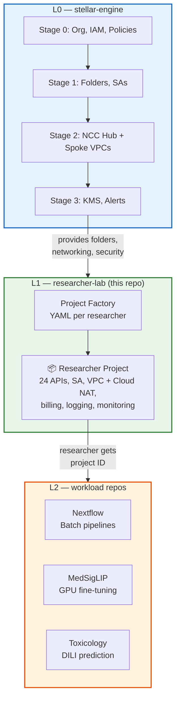
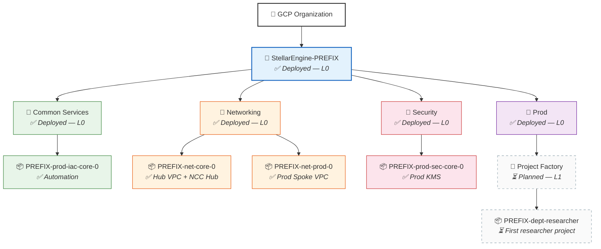

# Fast Science L1 — Researcher Labs

A fork of [Stellar Engine](https://github.com/gcp-stellar-engine/stellar-engine) that provisions researcher projects on top of an [L0 foundation](https://github.com/WandLZhang/fast-science-0-stellar-engine). This repo helps IT administration create department folders and base projects. The researcher can then deploy a workload from the L2 catalog.

## Architecture



## L1 Deployment Questionnaire

Fill in your values for researcher project provisioning. These feed into the project factory YAML and `terraform.tfvars`.

| # | Question | Your Value | Where It Goes |
|---|----------|-----------|---------------|
| 1 | **L0 Prefix** (same prefix used in L0 Stage 0) | `________` | Used to find outputs bucket: `<prefix>-prod-iac-core-outputs-0` |
| 2 | **Domain** (same as L0) | `________` | `envs_folders.Prod.admin` group domain |
| 3 | **Prod folder ID** (from L0 Stage 1 output) | `________` | `parent` in project YAML (optional — defaults to Prod folder) |
| 4 | **Department name** (e.g. `pathology`, `genomics`) | `________` | Project YAML filename + labels |
| 5 | **Researcher name** (e.g. `medsiglip`, `rnaseq`) | `________` | Project YAML filename + labels |
| 6 | **Workload type** — `medsiglip-pathology`, `nextflow-batch`, or custom | `________` | Determines which APIs and IAM roles to include |
| 7 | **Network project** (from L0 Stage 2 output, e.g. `net-prod-0`) | `________` | `shared_vpc_service_config.host_project` in YAML |
| 8 | **Subnet region/name** (from L0 Stage 2, e.g. `us-central1/default`) | `________` | `service_agent_subnet_iam` key in YAML |
| 9 | **Budget (monthly)** (optional) | `________` | Budget alert threshold |

---

## L1 Deployment Map

By this point L0 is assumed fully deployed (all ✅). This diagram tracks L1 project factory progress.



---


L1 uses Stellar Engine's [Project Factory](modules/project-factory/) to create researcher projects from YAML files. Each YAML file = one project. The filename controls the project name.

Each researcher project gets:
- A GCP project with a meaningful name (e.g., `univ-pathology-modeltuning`)
- Billing linked, logging + monitoring enabled
- Connected to L0 network (internet via Cloud NAT — pip install, HuggingFace, etc. just work)
- Service account for the researcher's pipeline
- Budget alerts

> **Note:** All steps below are run from this repo (L1). Since L0 and L1 are both forks of Stellar Engine with the same code, modules, and shared Terraform state (GCS), you can also follow these steps from the [L0 repo](https://github.com/WandLZhang/fast-science-0-stellar-engine) if you prefer.

### Step 1 — Enable project factory (one-time prerequisite)

```bash
cd fast/stages-aw/1-resman

# <prefix> is the prefix you chose during L0 Stage 0 setup (e.g., "wzuniv", "univ")
# The outputs bucket follows the naming convention: <prefix>-prod-iac-core-outputs-0
../../stage-links.sh gs://<prefix>-prod-iac-core-outputs-0
# Copy and paste the output commands
```

Create `terraform.tfvars` with the following content:

```hcl
envs_folders = {
  Prod = { admin = "group:gcp-organization-admins@yourdomain.com" }
}

fast_features = {
  envs            = true
  project_factory = true
}
```

Apply. The `0-globals.auto.tfvars.json` overrides `terraform.tfvars` for `fast_features`, so pass via `-var`:

```bash
terraform init
terraform apply -var='fast_features={envs=true, project_factory=true}'
```

### Step 2 — Set up the project factory stage

```bash
mkdir -p fast/stages-aw/3-project-factory-prod/data/projects
cd fast/stages-aw/3-project-factory-prod

# Download provider and tfvars from the outputs bucket
# (stage-links.sh doesn't recognize this new directory, so download explicitly)
gcloud alpha storage cp gs://<prefix>-prod-iac-core-outputs-0/providers/3-project-factory-prod-providers.tf ./
gcloud alpha storage cp gs://<prefix>-prod-iac-core-outputs-0/tfvars/0-globals.auto.tfvars.json ./
gcloud alpha storage cp gs://<prefix>-prod-iac-core-outputs-0/tfvars/0-bootstrap.auto.tfvars.json ./
gcloud alpha storage cp gs://<prefix>-prod-iac-core-outputs-0/tfvars/1-resman.auto.tfvars.json ./
```

Copy and edit `main.tf`:

```bash
cp main.tf.sample main.tf
# Edit main.tf — update lines marked # ← CHANGE with your L0 deployment values
```

### Step 3 — Create researcher project YAMLs

Each researcher project gets a YAML file. The filename becomes the project name suffix:

```bash
cp data/projects/dept-researcher-project.yaml.sample data/projects/my-dept-my-project.yaml
```

Edit the new file with your values:

```yaml
# data/projects/my-dept-my-project.yaml
# → creates project: <prefix>-my-dept-my-project

labels:
  department: my-dept
  researcher: my-researcher
  cost-center: "1234"

services:
  # Stellar Engine standard (from tenant project defaults)
  - accesscontextmanager.googleapis.com
  - bigquery.googleapis.com
  - bigqueryreservation.googleapis.com
  - bigquerystorage.googleapis.com
  - billingbudgets.googleapis.com
  - cloudbilling.googleapis.com
  - cloudbuild.googleapis.com
  - cloudkms.googleapis.com
  - cloudresourcemanager.googleapis.com
  - compute.googleapis.com
  - container.googleapis.com
  - essentialcontacts.googleapis.com
  - iam.googleapis.com
  - iamcredentials.googleapis.com
  - orgpolicy.googleapis.com
  - pubsub.googleapis.com
  - servicenetworking.googleapis.com
  - serviceusage.googleapis.com
  - stackdriver.googleapis.com
  - storage-component.googleapis.com
  - storage.googleapis.com
  - sts.googleapis.com
  # Research workload APIs
  - aiplatform.googleapis.com
  - notebooks.googleapis.com

# Connect to L0 network (the spoke VPC from Stage 2 provides Cloud NAT for internet)
shared_vpc_service_config:
  host_project: net-prod-0          # network project from L0 Stage 2
  service_agent_subnet_iam:
    "us-central1/prod-default":   # region/subnet-name
      - notebooks                           # Notebooks API agent
      - compute                             # Compute Engine agent

service_accounts:
  dept-a-researcher-1-0:
    display_name: "Terraform-managed."
    iam_self_roles:
      - roles/logging.logWriter
      - roles/monitoring.metricWriter
```

### Step 4 — Apply

```bash
terraform init
terraform plan
terraform apply
```

This creates:

```
📁 Prod
└── 📦 <prefix>-dept-a-researcher-1         (researcher's project)
    ├── Billing linked
    ├── Connected to L0 network (Cloud NAT for internet)
    ├── Logging + monitoring enabled
    ├── 11 APIs pre-enabled (compute, AI platform, batch, notebooks, ...)
    ├── Service account with log/metric write permissions
    └── Labels: department, researcher, cost-center
```

> **📋 Update Deployment Map:** L1 project factory is complete. In the Deployment Map diagram above, change nodes **PF** and **RP1** from `⏳ Planned` to `✅ Deployed`. Change their styles from dashed gray to solid: PF/RP1 → `fill:#f3e5f5,stroke:#6a1b9a`. Replace `PREFIX-dept-researcher` with the actual project name.

### Step 5 — Hand off to researcher

Give the researcher:
1. Their project ID (e.g., `<prefix>-dept-a-researcher-1`)
2. A link to the appropriate L2 workload repo

The researcher uses the L2 repo's README to deploy their workload

```bash
export GCP_PROJECT_ID="<prefix>-dept-a-researcher-1"
# Researcher follows their L2 workload README
```

## Onboarding Another Researcher

Add another YAML file:

```yaml
# data/projects/dept-b-researcher-2.yaml
parent: folders/NNNNNNNNNNNN
labels:
  department: dept-b
  researcher: researcher-2

services:
  # Same standard set — use data_merges in main.tf to avoid repeating
  - accesscontextmanager.googleapis.com
  - bigquery.googleapis.com
  - bigqueryreservation.googleapis.com
  - bigquerystorage.googleapis.com
  - billingbudgets.googleapis.com
  - cloudbilling.googleapis.com
  - cloudbuild.googleapis.com
  - cloudkms.googleapis.com
  - cloudresourcemanager.googleapis.com
  - compute.googleapis.com
  - container.googleapis.com
  - essentialcontacts.googleapis.com
  - iam.googleapis.com
  - iamcredentials.googleapis.com
  - orgpolicy.googleapis.com
  - pubsub.googleapis.com
  - servicenetworking.googleapis.com
  - serviceusage.googleapis.com
  - stackdriver.googleapis.com
  - storage-component.googleapis.com
  - storage.googleapis.com
  - sts.googleapis.com
  - aiplatform.googleapis.com
  - notebooks.googleapis.com

shared_vpc_service_config:
  host_project: net-prod-0

service_accounts:
  dept-b-researcher-2-0:
    display_name: "Terraform-managed."
```

Re-apply. Done.

## What You Touch vs What You Don't

Same principle as L0 — minimize changes to Stellar Engine golden artifacts:

| ✅ Edit | 🚫 Don't Edit |
|---------|---------------|
| `terraform.tfvars` — tenant definitions | `*.tf` — stage logic |
| `data/*.yaml` — if using project factory | `modules/*` — Stellar Engine modules |

## Upstream Sync

This repo tracks [Stellar Engine](https://github.com/gcp-stellar-engine/stellar-engine) upstream:

```bash
git fetch upstream
git merge upstream/main
# Conflicts only in README.md (the only file we changed)
```

## Related Repos

| Layer | Repo | Purpose |
|-------|------|---------|
| **L0** | [fast-science-0-stellar-engine](https://github.com/WandLZhang/fast-science-0-stellar-engine) | GCP org landing zone (Stages 0-3) |
| **L1** | This repo | Researcher project provisioning via tenants |
